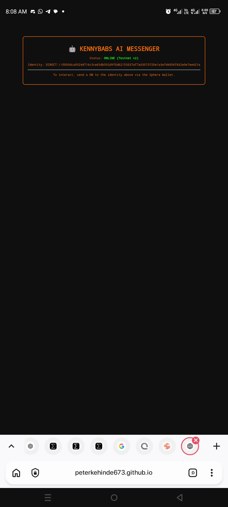

# 🤖 Kennybabs AI Messenger

An autonomous social messaging agent built for the **Unicity Sphere Network**.

## 🌐 Live Web App
**Visit the status page here:** [https://peterkehinde673.github.io/kennybabs-ai-messenger/](https://peterkehinde673.github.io/kennybabs-ai-messenger/)

## 🚀 Overview
Kennybabs AI Messenger is a headless agent designed to run in a mobile Linux environment (Termux).

- **Track:** Social and Messaging
- **Identity:** `DIRECT://0000dca8924d716c3ce65db592d9f8d62153837af7a83073f20e1a3efd4806f682e0e7ee421a`

## 📸 Proof of Deployment

### 1. Public Web App (Landing Page)


### 2. Backend Agent (Termux)


## 🛠️ Setup and Installation
To start the agent:
```bash
node screenshot-mode.js
```
