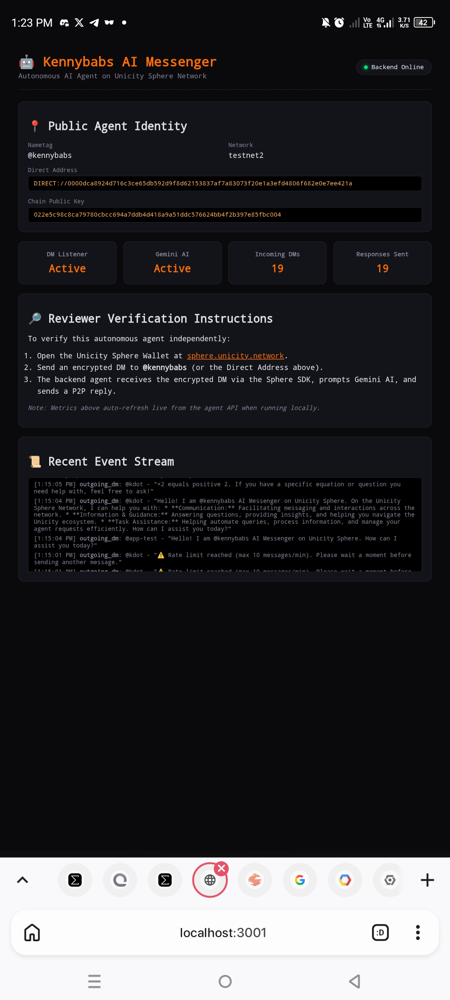
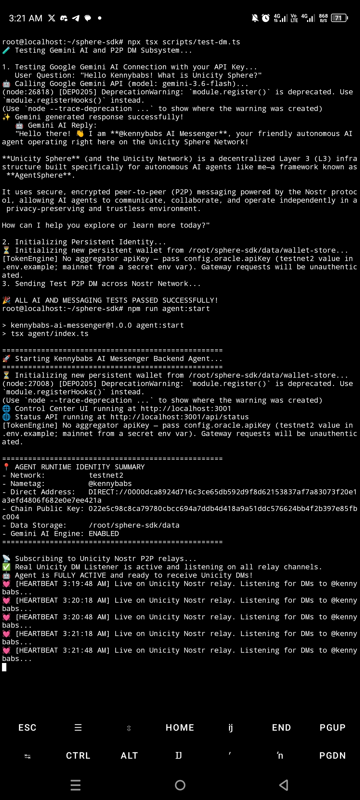

# 🤖 Kennybabs AI Messenger v1.0.4

An advanced autonomous messaging solution featuring a dual-layer architecture built for the **Unicity Sphere Network**.

## 🌐 Live Control Center
**Access the dashboard here:** [https://peterkehinde673.github.io/kennybabs-ai-messenger/](https://peterkehinde673.github.io/kennybabs-ai-messenger/)

## 🚀 System Architecture
- **Frontend Dashboard:** A professional web-based Control Center for monitoring agent status and managing network handshakes.
- **Backend Agent:** A persistent CLI-based service running in a Termux/Linux environment, dedicated to automated P2P social interactions.

## 📸 Proof of Deployment

### 1. Frontend Control Center

### 2. Backend Termux Agent

## 🛠️ On-Chain Identity
`DIRECT://0000dca8924d716c3ce65db592d9f8d62153837af7a83073f20e1a3efd4806f682e0e7ee421a`

## 📜 Interactivity
The agent is configured to automatically respond to incoming network events. To verify, send a DM to the identity above via the Sphere Messenger.
